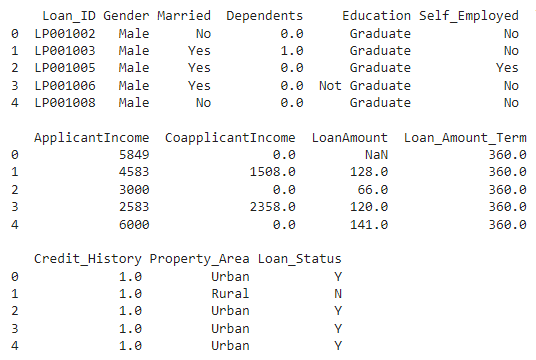
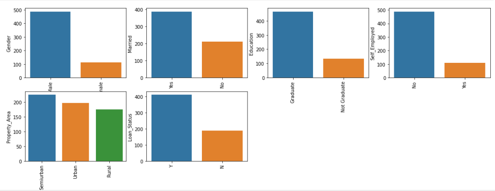
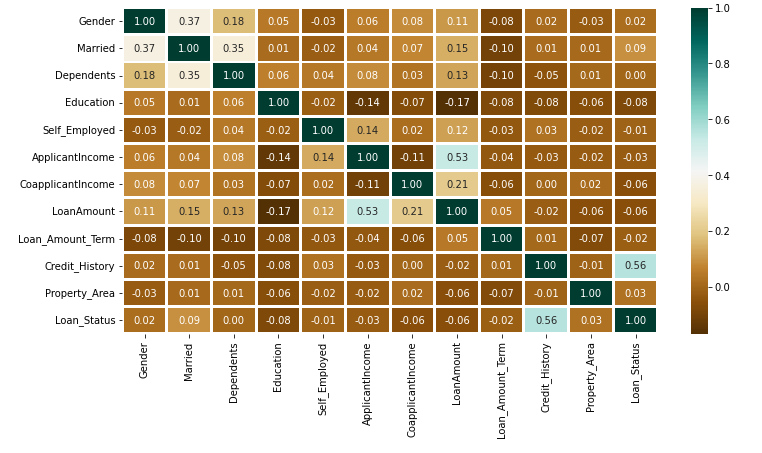
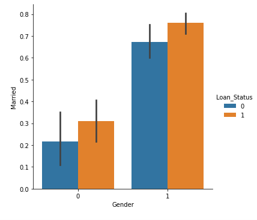

# NAI 4
Prognoza zatwierdzenia pożyczki

## Twórcy
Daniel Chabowski | s21164

Szymon Dejewski | s2124

## Wyniki

### wizualizacja danych

### Wszystkie wartości pokazane na wykresie

### Poniższa mapa heatmapa pokazuje korelację między kwotą pożyczki a dochodem wnioskodawcy. Pokazuje również, że Credit_History ma duży wpływ na Loan_Status.

### Wykres dla płci i stanu cywilnego

### Console output
Categorical variables: 7\
Categorical variables: 0\
Gender               0\
Married              0\
Dependents           0\
Education            0\
Self_Employed        0\
ApplicantIncome      0\
CoapplicantIncome    0\
LoanAmount           0\
Loan_Amount_Term     0\
Credit_History       0\
Property_Area        0\
Loan_Status          0\
((598, 11), (598,))\
((358, 11), (240, 11), (358,), (240,))\
Accuracy score of  RandomForestClassifier = 98.04469273743017\
Accuracy score of  KNeighborsClassifier = 78.49162011173185\
Accuracy score of  SVC = 68.71508379888269\
Accuracy score of  LogisticRegression = 80.44692737430168